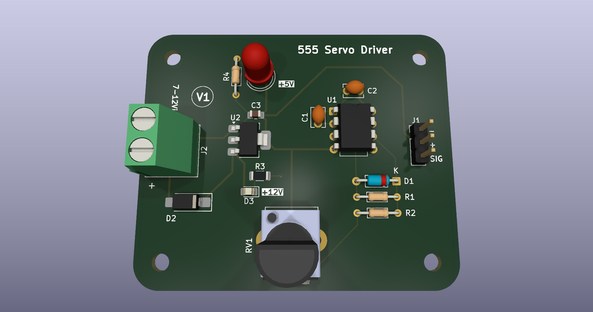
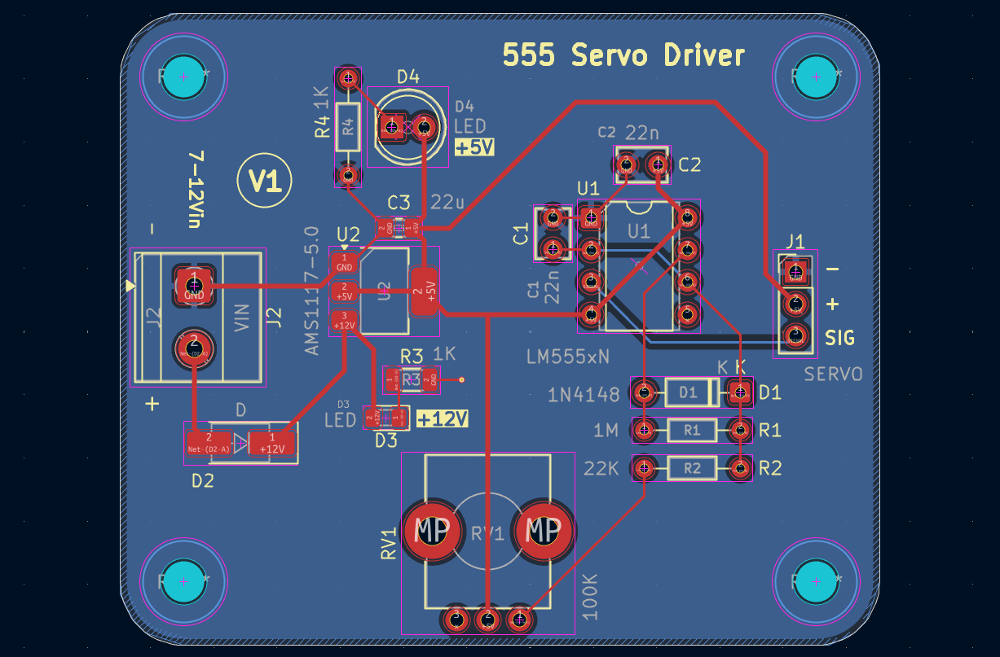
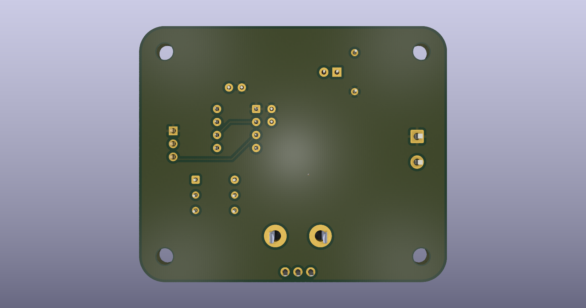
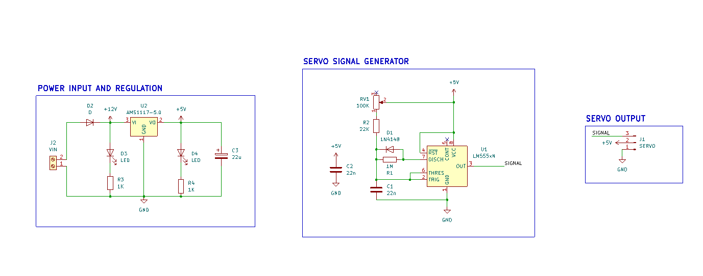

# 555 Servo Controller



A 555 timer based servo controller designed in KiCad as part of my PCB design learning journey. This project focuses primarily on the complete PCB design workflow, from schematic and footprint selection to PCB layout, 3D visualization, design-rule verification, and preparation of fabrication files.

> **Project status:** PCB design completed. The board has not been physically manufactured or tested.

---

## Overview

This project was created while working through the training modules by NU Teams.

The main goal was to practice the complete PCB design process in KiCad, including:

- Creating and working with a schematic
- Selecting and assigning footprints
- Designing the PCB layout
- Component placement and routing
- PCB mechanical considerations
- 3D visualization of the board
- Generating fabrication and assembly files
- Running ERC and DRC checks
- Organizing a complete KiCad project for sharing and reuse

The underlying circuit uses a 555 timer to generate the control signal for a servo. The circuit itself is kept relatively simple here, as the primary focus of this repository is the **PCB design and documentation workflow**.

---

## Repository Structure

```text
Servo-Controller-555/
│
├── .gitattributes
├── .gitignore
├── LICENSE
├── README.md
│
├── Servo Controller 555.kicad_pcb
├── Servo Controller 555.kicad_pro
├── Servo Controller 555.kicad_sch
│
├── assets/
│   ├── pcb-3d-front.png
│   ├── pcb-3d-back.png
│   ├── schematic.png
│   └── pcb-layout.png
│
├── documentation/
│   ├── schematic.pdf
│   ├── pcb-layout.pdf
│   └── verification/
│       ├── ERC.rpt
│       └── DRC.rpt
│
├── fabrication/
│   ├── gerbers/
│   ├── drills/
│   ├── BOM.csv
│   └── position.csv
│
└── external-cad/
    └── Potentiometer_Bourns_PTV09A-1_Single_Vertical.step

```

---

## Features

- 555 timer based servo controller
- Custom PCB layout designed in KiCad
- Through-hole and SMD components
- Adjustable servo control using a potentiometer
- Custom component footprints
- 3D PCB visualization
- External STEP model for component visualization
- ERC and DRC verification
- Fabrication-ready Gerber and drill files
- Bill of Materials (BOM)
- Component position / Pick-and-Place file

---

## PCB Design

The PCB was designed with emphasis on:

- Component placement
- Routing and trace organization
- Connector accessibility
- Mounting-hole placement
- Board outline and mechanical clearances
- Clear silkscreen labeling
- 3D representation of the completed PCB design

### PCB Layout



[View PCB Layout PDF](documentation/pcb-layout.pdf)

### 3D View

#### Front


#### Back



---

## Circuit Overview

The circuit is based around a 555 timer configured to generate a servo control signal.

A potentiometer is used to vary the timing of the generated pulse, allowing the servo position to be adjusted.

The schematic is included primarily to document the electrical design associated with the PCB.

### Schematic



[View Schematic PDF](documentation/schematic.pdf)

---

## Design Verification

The design was checked using KiCad's Electrical Rules Checker (ERC) and Design Rules Checker (DRC).

### ERC

- Errors: **0**
- Warnings: **0**

[View ERC Report](documentation/verification/ERC.rpt)

### DRC

- Violations: **0**
- Unconnected pads: **0**
- Footprint errors: **0**

[View DRC Report](documentation/verification/DRC.rpt)

> These checks verify the design according to the configured KiCad rules. They do not replace physical testing of a manufactured PCB.

---

## Fabrication Files

Although this PCB has **not been physically manufactured**, the repository contains the files generated during the design process for potential future fabrication and assembly.

<details>
<summary>Available fabrication files</summary>

### Gerbers

PCB manufacturing files generated from the PCB layout.

[Open Gerber files](fabrication/gerbers/)

### Drill Files

Drill data generated for the PCB.

[Open drill files](fabrication/drills/)

### Bill of Materials

Component list generated from the KiCad project.

[View BOM](fabrication/BOM.csv)

### Position File

Component placement information generated from the PCB design.

[View Position File](fabrication/position.csv)

</details>

---

## External CAD Models

The PCB uses an external STEP model for component visualization in KiCad's 3D Viewer.

The model is stored separately from the KiCad project files:

```text
external-cad/
└── Potentiometer_Bourns_PTV09A-1_Single_Vertical.step
```

The PCB references the model using a project-relative path so that the model can be resolved when the repository is cloned to another system.

> The redistribution rights of externally sourced CAD models depend on their original license/source. The external model is therefore treated separately from the project's own hardware design files.

---


## Opening the Project

The project can be opened directly in KiCad using the project file:

```text
Servo Controller 555.kicad_pro
```

The schematic, PCB layout, and associated project files are kept together so that the project can be cloned and opened as a complete KiCad project.

---

## Learning Source

This project was completed while following the **PCB Design Zero-to-Hero** training modules by NU Teams.

The training material provided the learning framework for the project, while this repository contains my KiCad project files, PCB layout, documentation, verification results, and generated fabrication outputs.

[PCB Design Zero-to-Hero — Training Modules](https://training.nuteams.org/pcb-design-zero-to-hero)

---

## License

This project is licensed under the **CERN Open Hardware Licence Version 2 – Strongly Reciprocal (CERN-OHL-S-2.0)**.

See [`LICENSE`](LICENSE) for the complete license text.

---

## Author

**Shlok Chorge**
[GitHub Profile](https://github.com/shlok-ac)
